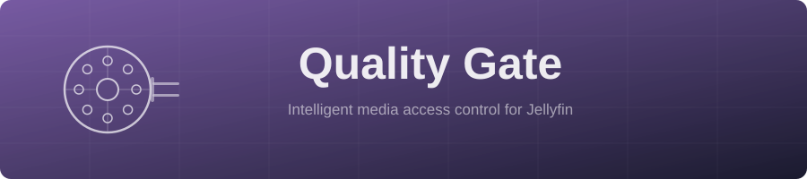

<p align="center"></p>

<h1 align="center">Quality Gate</h1>

<p align="center">
  <a href="https://github.com/GeiserX/quality-gate/releases"></a>
  <a href="https://jellyfin.org"></a>
  <a href="https://dotnet.microsoft.com"></a>
  <a href="LICENSE"></a>
  <a href="https://github.com/GeiserX/quality-gate/actions"></a>
  <a href="https://github.com/GeiserX/quality-gate/actions/workflows/build.yml"></a>
  <a href="https://codecov.io/gh/GeiserX/quality-gate"></a>
</p>

<p align="center"><strong>Cap the resolution a Jellyfin user may be served</strong></p>

Quality Gate caps how tall a video a user can be served. The cap is measured against the media's
real height, read from its video stream, so it holds whatever the file is called and survives a
rename, a re-encode or a symlink.

Media above the cap is not hidden. It is served as a capped transcode, or as a lower-resolution
version of the same item where one exists, and requests for the original file are refused.

It also, optionally, groups an encoded copy with its original so a single film shows two versions
instead of appearing twice.

## Documentation

| Guide | What it covers |
|---|---|
| [Getting started](docs/getting-started.md) | Install, cap one user at 720p, and prove the cap holds |
| [Installation](docs/installation.md) | Every install method, upgrading, building from source, releases |
| [Configuration](docs/configuration.md) | Every setting, how a user's policy is chosen, **and the fields that do not restrict playback** |
| [How it works](docs/how-it-works.md) | The routes covered, the one that is not, and what to trust |
| [One library, two qualities](docs/one-library.md) | Keeping a smaller encode beside each original |
| [Encode priority](docs/encode-priority.md) | Having the encoder make the copies capped viewers are about to watch first |
| [Troubleshooting](docs/troubleshooting.md) | When it is not behaving |

## Read this before configuring anything

Quality Gate began as a filename-pattern filter. Since 3.4.0.0 those patterns enforce nothing.

The port to Jellyfin 12 stopped registering `MediaSourceResultFilter`, the component that read
them. The fields are still in the config page and still saved, but no code consults them for
playback. The same goes for the fallback-transcode and blocked-message settings.

**`Maximum Resolution` is the only setting that restricts playback.** A policy that blocks
`- 2160p` by filename pattern and leaves the resolution at `No limit` restricts nobody. If you
are coming from 3.3.x or earlier, translate your patterns into a height.

[Configuration](docs/configuration.md#fields-that-do-not-restrict-playback) lists them exactly.

## What it does

- **A measured resolution cap.** 480p, 720p, 1080p, 1440p or 4K, checked against the item's
  video stream rather than its name.
- **Both delivery paths.** It shapes playback negotiation, and refuses the direct stream, HLS,
  universal and original-file routes that skip negotiation entirely. One legacy HLS segment route
  is a known, documented exception.
- **Per-user policies.** Assign policies individually, set a default, or mark a user explicitly
  unrestricted.
- **Version grouping.** Optional, movies libraries only. Groups `Film - 720p.mp4` with
  `Film.mkv` wherever the two sit, including a flat library root where Jellyfin would otherwise
  show two films. Applies to every movie library, or only the paths you list. Rebuilt on every
  scan, so it persists where a manual merge does not.
- **Per-policy intro videos.** Optional. A different pre-roll for restricted users.
- **Logging you can debug from.** Every decision names the cap, the user and the policy.

## Requirements

Jellyfin 12, on `net10.0`. Version 3.4.0.0 and later will not load on Jellyfin 10.x; 3.3.6.0 is
the last build for 10.11 and is unmaintained.

## Install

Add this repository under **Dashboard, Plugins, Repositories**:

```text
https://geiserx.github.io/quality-gate/manifest.json
```

Install from the catalogue, restart Jellyfin, then confirm the plugin shows **Active**. Full
instructions, including manual installs, are in [installation](docs/installation.md).

## Quick start

1. **Dashboard, Plugins, QualityGate**.
2. Add a policy, name it, set **Maximum Resolution** to `720p`. Leave the rest alone.
3. Assign a user to it in the **User Access** table.
4. Sign in as that user and play something in 1080p. Check **Dashboard, Activity**: the video
   being served must be at or below your cap. Both outcomes are correct, and which you get
   depends on the media. A capped transcode of the original, or direct play of a smaller version
   of the same item where one exists. Seeing "Direct playing" is not a failure by itself; being
   served something taller than the cap is.

Then verify it properly, because an unloaded plugin is indistinguishable from a working one that
allows everything:

```bash
curl -s -o /dev/null -w '%{http_code}\n' \
  -H 'Authorization: MediaBrowser Token="<capped-user-token>"' \
  'https://your-server/Items/<item-id>/Download'
```

`403` is correct for an item above the cap. Run it as an unrestricted user too and confirm `200`,
so you know the test can tell the two apart.

## What this is not

This is not DRM. Quality Gate shapes what the Jellyfin API delivers. Somebody with filesystem
access, or a copy they already downloaded, is out of scope.

There is also no fallback outside the plugin. If it fails to load, every user is unrestricted and
Jellyfin reports nothing unusual. If you rely on the cap rather than on separate libraries, alert
on the plugin not being `Active`. [Troubleshooting](docs/troubleshooting.md#the-plugin-vanished-after-an-update)
covers a failure mode that does exactly that, silently.

## Security

Quality Gate is access control, so review your policies deliberately. Only administrators can
configure them. Report vulnerabilities through [SECURITY.md](SECURITY.md).

One behaviour worth knowing: deleting or disabling a policy that users are assigned to currently
grants those users full access rather than removing it. Point users at a low-cap policy instead.
[Configuration](docs/configuration.md#a-gap-worth-knowing-about) explains why.

## Contributing

Pull requests are welcome. Fork, branch, and open a PR. CI has to be green and the patch covered.
[Installation](docs/installation.md#building-from-source) has the build and test commands.

## Other Jellyfin projects by GeiserX

- [smart-covers](https://github.com/GeiserX/smart-covers) provides cover extraction for books, audiobooks, comics, magazines and music libraries, with online fallback
- [whisper-subs](https://github.com/GeiserX/whisper-subs) generates subtitles locally using Whisper
- [quality-gate-encoder](https://github.com/GeiserX/quality-gate-encoder) (formerly jellyfin-encoder) does automatic 720p HEVC, H.264 or AV1 transcoding, with optional symlinks for multi-version support
- [jellyfin-telegram-channel-sync](https://github.com/GeiserX/jellyfin-telegram-channel-sync) syncs Jellyfin access with Telegram channel membership

## License

GPL-3.0. See [LICENSE](LICENSE).

## Acknowledgments

- [Jellyfin](https://jellyfin.org), the Free Software Media System
- The Jellyfin plugin development community
