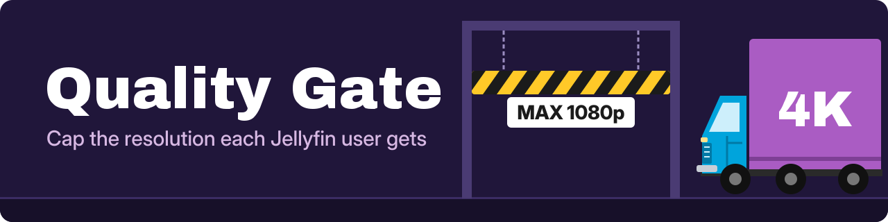
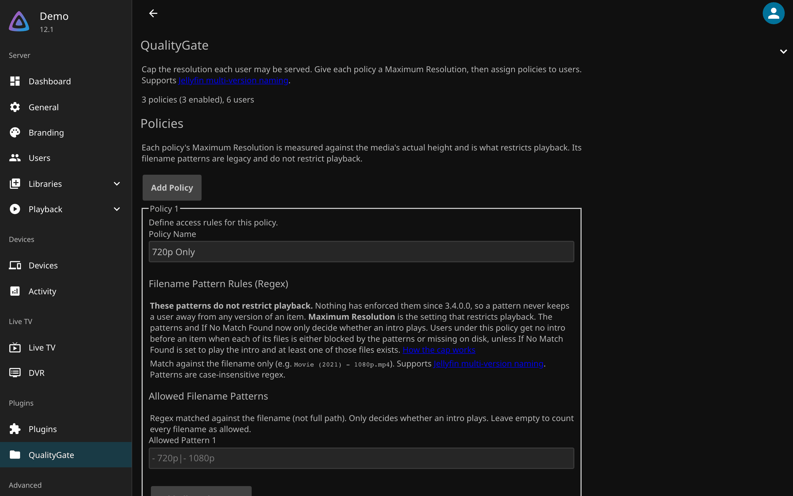

<p align="center"></p>

<p align="center">
  <a href="https://github.com/GeiserX/quality-gate/releases"></a>
  <a href="https://github.com/GeiserX/quality-gate/actions/workflows/ci.yml"></a>
  <a href="LICENSE"></a>
  <a href="https://github.com/GeiserX/quality-gate/stargazers"></a>
  <a href="https://codecov.io/gh/GeiserX/quality-gate"></a>
</p>

**Quality Gate** is a Jellyfin plugin that caps the video height each user can be served: 480p, 720p, 1080p, 1440p or 4K, per user or as a default for everyone. The cap is measured on the file's real video stream, so a rename, a re-encode or a symlink does not get around it. Media above the cap arrives as a capped transcode, or as a smaller version of the same item when one exists, and the original file is refused.

Jellyfin's own limit is a bitrate for remote clients, not a height: a low-bitrate 4K file passes it, a viewer on the local network is not limited at all, and a client's quality setting is the viewer's own choice. Quality Gate checks pixels, for every client, on every route that hands out video, with one documented exception.

<p align="center"></p>

## Features

- A measured cap: 480p, 720p, 1080p, 1440p or 4K, checked against the item's video stream, never its filename.
- Per-user policies: assign one per user, set a default for everyone else, or mark a user unrestricted.
- A capped user cannot direct-play, stream, download or fetch the original file; one legacy HLS segment route is a documented exception.
- Smaller copies play as they are: keep a 720p encode beside each original and capped viewers get it without a transcode.
- One film, two qualities: optional version grouping shows `Film.mkv` and `Film - 720p.mkv` as one film with two versions, in movies libraries, rebuilt on every scan.
- API keys and anonymous requests can be held to a policy of their own.
- Encode priority for [quality-gate-encoder](https://github.com/GeiserX/quality-gate-encoder): the copies your capped viewers are about to watch are encoded first.
- A different intro video per policy, and a log line for every decision naming the user, the cap and the policy.

## Quick start

Needs Jellyfin 12: add this repository under **Dashboard, Plugins, Repositories**, install **QualityGate** from the catalogue, restart, and confirm it shows **Active**:

```text
https://geiserx.github.io/quality-gate/manifest.json
```

Then open **Dashboard, Plugins, QualityGate**, add a policy with **Maximum Resolution** `720p` (the only field that restricts playback), assign a user under **User Access** and save. As that user, a `curl` on `/Items/<id>/Download` of a 1080p film must answer `403`, and an unrestricted user must get `200` ([Getting started](https://geiserx.github.io/quality-gate/getting-started/#prove-it-works) has the command).

It is not DRM, and if the plugin fails to load every user is unrestricted, so watch that it stays **Active**.

## Documentation

The full documentation is at [geiserx.github.io/quality-gate](https://geiserx.github.io/quality-gate/).

- [Getting started](https://geiserx.github.io/quality-gate/getting-started/): install from the repository or by hand, cap one user at 720p, prove it, upgrade
- [Usage](https://geiserx.github.io/quality-gate/usage/): the settings page section by section, with screenshots
- [One library, two qualities](https://geiserx.github.io/quality-gate/one-library/): a smaller copy beside each original, shown as one film with two versions
- [Encode priority](https://geiserx.github.io/quality-gate/encode-priority/): having the encoder make the copies capped viewers need first
- [Configuration](https://geiserx.github.io/quality-gate/configuration/): every setting, how a user's policy is chosen, and the fields that do not restrict playback
- [How it works](https://geiserx.github.io/quality-gate/how-it-works/): the routes covered, the one that is not, what to trust
- [Troubleshooting](https://geiserx.github.io/quality-gate/troubleshooting/): when it is not behaving
- [Development](https://geiserx.github.io/quality-gate/development/): building from source, tests, releases
- [Related projects](https://geiserx.github.io/quality-gate/related/): the encoder and the rest of the family

Report security problems through the [security policy](SECURITY.md), not in a public issue.

## Related projects

- [quality-gate-encoder](https://github.com/GeiserX/quality-gate-encoder) (formerly jellyfin-encoder) does automatic 720p HEVC, H.264 or AV1 transcoding, with optional symlinks for multi-version support
- [smart-covers](https://github.com/GeiserX/smart-covers) provides cover extraction for books, audiobooks, comics, magazines and music libraries, with online fallback
- [whisper-subs](https://github.com/GeiserX/whisper-subs) generates subtitles locally using Whisper
- [jellyfin-telegram-channel-sync](https://github.com/GeiserX/jellyfin-telegram-channel-sync) syncs Jellyfin access with Telegram channel membership

## License

[GPL-3.0-or-later](LICENSE). Thanks to [Jellyfin](https://jellyfin.org) and its plugin community.
