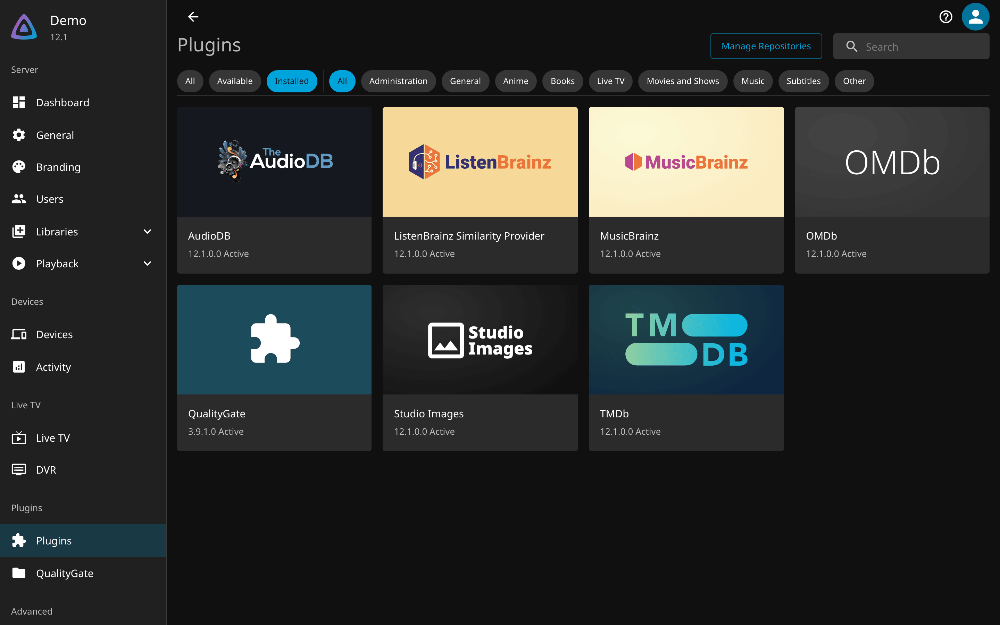

# Getting started

This walks through installing QualityGate and capping one user at 720p. It takes about ten
minutes, and the last step tells you how to prove the cap actually holds.

## Requirements

- Jellyfin 12 (`targetAbi` is `12.0.0.0`, `net10.0`). QualityGate 3.4.0.0 and later will not load on 10.x. If you are still on 10.11, the last build for it is 3.3.6.0, and it is no longer maintained.
- Admin access to the Jellyfin web UI.
- Your media must have been scanned, so Jellyfin knows each file's real resolution. The cap
  reads the height from the video stream, so an item Jellyfin has never probed cannot be
  measured.

## Install from the plugin repository

1. In Jellyfin, go to **Dashboard, Plugins, Repositories** and add:

   ```
   https://geiserx.github.io/quality-gate/manifest.json
   ```

2. Go to **Catalogue**, find **QualityGate**, and install the newest version.
3. Restart Jellyfin. A plugin does not load until the server restarts.
4. Go back to **Plugins** and check that QualityGate shows **Active**. Anything else means it
   did not load, and nothing is being enforced. See
   [troubleshooting](troubleshooting.md#the-plugin-vanished-after-an-update).



The plugin GUID is `9cab70ca-0af3-4d3a-adab-6a0df2496a33`. You need it for the configuration
API, and for the reinstall command in [troubleshooting](troubleshooting.md#the-plugin-vanished-after-an-update).

To install without the repository, see [Manual installation](#manual-installation) below. Building
from source is in [Development](development.md#building-from-source).

## Create a policy

Open **Dashboard, Plugins, QualityGate**.

1. Under **Policies**, add a policy.
2. Name it something you will recognise later, for example `720p Only`.
3. Set **Maximum Resolution** to **720p**.
4. Leave everything else alone. Several of the other fields do not restrict playback in the
   current build, and [configuration](configuration.md#fields-that-do-not-restrict-playback)
   explains exactly which.
5. Save.

**Maximum Resolution is the only field that restricts playback.** If you set it to `No limit`,
the policy caps nothing, no matter what else you fill in.

## Assign a user

In the **User Access** table, set the user to your new policy and save.

Three things decide which policy a user gets, in this order:

1. An explicit assignment for that user wins.
2. Otherwise the default policy applies, if you set one.
3. Otherwise the user is unrestricted.

`Full access` is an explicit choice you can assign, and it beats the default policy. That is
the way to exempt one person while everyone else inherits a default.

## Prove it works

Do not skip this. A cap you have not tested is a guess, and the failure mode is silent: an
unloaded plugin looks exactly like a loaded one that is allowing everything.

Sign in as the capped user and play something you know is 1080p or larger. You should see it
play, because QualityGate does not hide media. What changes is how it is delivered. Check
**Dashboard, Activity** while it plays and look at the height being served, not at the delivery
mode.

Two outcomes are both correct, and which one you get depends on the media:

- **A capped transcode** of the original, when that item has no smaller version.
- **Direct play of a smaller version** of the same item, when one exists. QualityGate offers the
  within-cap sibling instead of transcoding, which is cheaper and looks the same to the viewer.

So "Direct playing" is not a failure on its own. Being served a height above your cap is.

For a harder check, ask the server for the original bytes directly. As the capped user, with
their access token:

```bash
curl -s -o /dev/null -w '%{http_code}\n' \
  -H 'Authorization: MediaBrowser Token="<capped-user-token>"' \
  'https://your-server/Items/<item-id>/Download'
```

A capped user must get `403` for an item above the cap. If you get `200`, the cap is not
working. Run the same request as an unrestricted user and confirm you get `200` there, so you
know the test itself is meaningful.

## Manual installation

Take the version number from the
[latest release](https://github.com/GeiserX/quality-gate/releases/latest) rather than copying
one from a document. Extract the zip so that `Jellyfin.Plugin.QualityGate.dll` sits directly
inside a folder under `plugins/`.

Jellyfin expects this layout:

```text
config/plugins/
  QualityGate_3.9.1.0/
    Jellyfin.Plugin.QualityGate.dll
    build.yaml
    meta.json          <- written by Jellyfin's installer, not present in the zip
```

The folder name is conventionally `Name_Version`. The release zip contains only the DLL and
`build.yaml`; `meta.json` is written by Jellyfin itself when it installs from the repository, and
it is what Jellyfin reads to know which version is installed and whether an update exists.

Do not hand-write `meta.json`, and never copy one from an older version folder. It carries
`"status": "Deleted"`, and the plugin will remove itself on the next restart. If you need version
tracking, install from the repository instead of by hand.

### Docker

```bash
VERSION="3.9.1.0"
curl -L -o QualityGate.zip \
  "https://github.com/GeiserX/quality-gate/releases/download/v${VERSION}/quality-gate_${VERSION}.zip"
unzip QualityGate.zip -d /path/to/jellyfin/config/plugins/QualityGate_${VERSION}/
docker restart jellyfin
```

### Linux

```bash
VERSION="3.9.1.0"
curl -L -o QualityGate.zip \
  "https://github.com/GeiserX/quality-gate/releases/download/v${VERSION}/quality-gate_${VERSION}.zip"
sudo unzip QualityGate.zip -d /var/lib/jellyfin/plugins/QualityGate_${VERSION}/
sudo chown -R jellyfin:jellyfin /var/lib/jellyfin/plugins/QualityGate_${VERSION}/
sudo systemctl restart jellyfin
```

### Windows

There are two data directories, and which one applies depends on how Jellyfin was installed:

- Installed as a **Windows service** (the default installer):
  `%PROGRAMDATA%\Jellyfin\Server\plugins\QualityGate_<version>\`
- **Portable** or tray builds run under your own account:
  `%LOCALAPPDATA%\jellyfin\plugins\QualityGate_<version>\`

Putting the DLL in the wrong one leaves it outside the folder Jellyfin scans, and it will simply
never appear. Confirm which applies from **Dashboard, About**, then restart Jellyfin from
Services or the tray icon.

### macOS

Use whichever data directory your install actually reports, rather than assuming. Check
**Dashboard, About**, or `JELLYFIN_DATA_DIR` if you set it. For a default install that is
`~/.local/share/jellyfin`.

```bash
VERSION="3.9.1.0"
DATA_DIR="$HOME/.local/share/jellyfin"   # confirm this against Dashboard, About
curl -L -o QualityGate.zip \
  "https://github.com/GeiserX/quality-gate/releases/download/v${VERSION}/quality-gate_${VERSION}.zip"
unzip QualityGate.zip -d "$DATA_DIR/plugins/QualityGate_${VERSION}/"
```

## Upgrading

Update through the catalogue and restart. Jellyfin marks the old version folder deleted and
removes it on the next start.

On overlay filesystems, notably Unraid's shfs, that removal can fail in a way that takes the new
version with it. If a plugin disappears after an upgrade, that is what happened, and
[troubleshooting](troubleshooting.md#the-plugin-vanished-after-an-update) has the recovery.

Upgrading never touches your policies. They live in
`config/plugins/configurations/Jellyfin.Plugin.QualityGate.xml`, outside the plugin folder.

## What to read next

- [Configuration](configuration.md) for every setting, and for the ones that do not restrict
  playback.
- [How it works](how-it-works.md) for the routes that are covered, and the one that is not.
- [One library, two qualities](one-library.md) if you keep a smaller encode beside each
  original and want both to appear as a single item.
- [Troubleshooting](troubleshooting.md) when something is not behaving.
