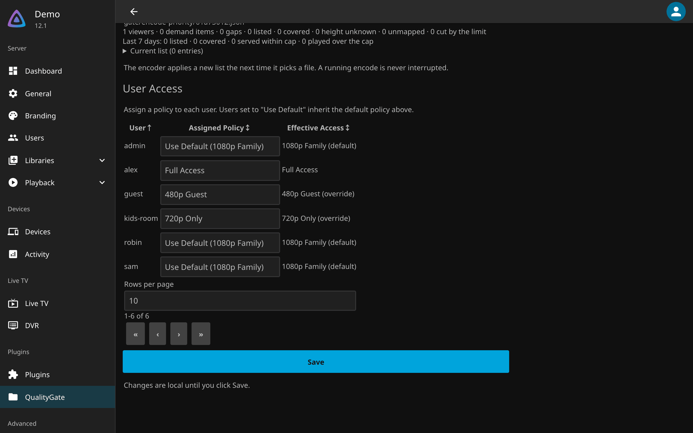
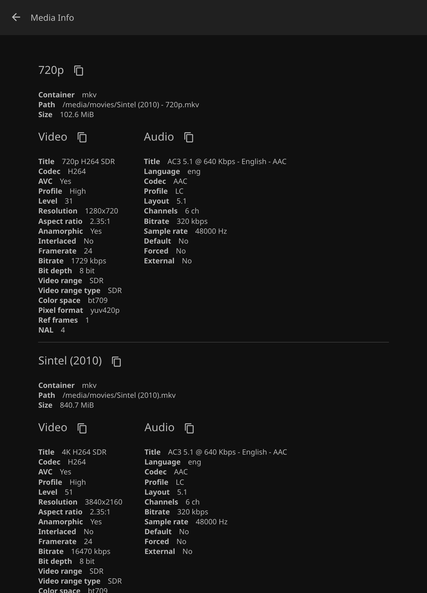
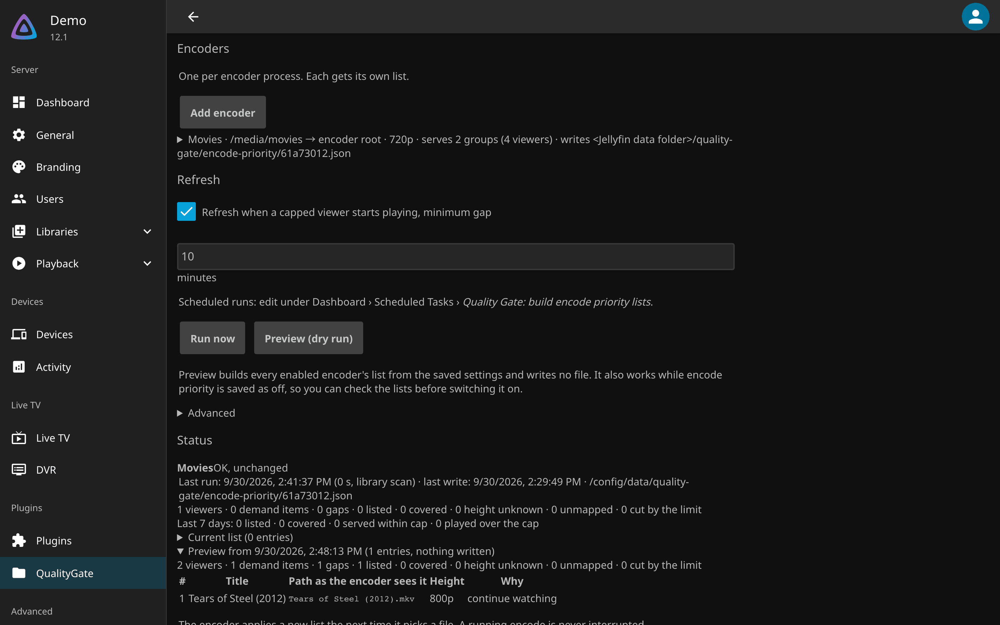
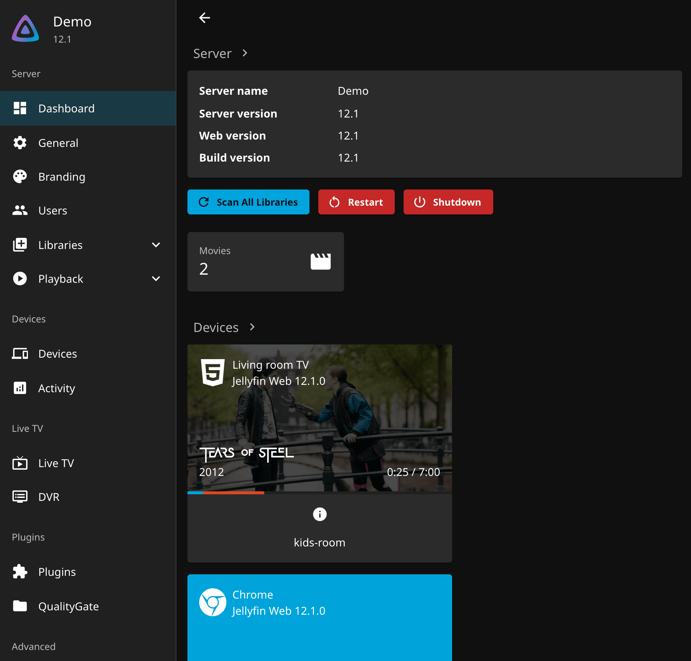
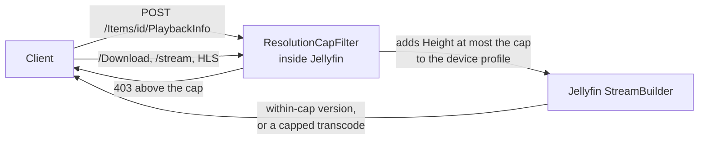

---
hide:
  - navigation
  - toc
---

# Quality Gate { .qg-visually-hidden }

  

  
  
  
  
  

---

**Quality Gate** is a Jellyfin plugin that caps the video height each user can be served: 480p, 720p, 1080p, 1440p or 4K, per user or as a default for everyone. The cap is measured on the file's real video stream, so a rename, a re-encode or a symlink does not get around it. Media above the cap arrives as a capped transcode, or as a smaller version of the same item when one exists, and the original file is refused. Jellyfin's own limit is a bitrate for remote clients, not a height: a low-bitrate 4K file passes it and a viewer on the local network is not limited at all. Start with [Getting started](getting-started.md), then read the settings page section by section in [Usage](usage.md).

-   :material-download: **[Getting started](getting-started.md)**

    ---

    Add the plugin repository to Jellyfin 12, install, cap one user at 720p and prove the cap holds with one `curl`.

-   :material-tune: **[Usage](usage.md)**

    ---

    The settings page section by section: policies, user access, version grouping and encode priority, each with a screenshot.

-   :material-filmstrip-box-multiple: **[One library, two qualities](one-library.md)**

    ---

    Keep a smaller copy beside each original and have Jellyfin show them as one film with two versions.

-   :material-format-list-bulleted: **[Configuration](configuration.md)**

    ---

    Every setting, its default, how a user's policy is chosen, and the fields that restrict nothing.

## The settings page

<figure markdown>

<figcaption>User Access: one row per user, an explicit policy or the default</figcaption>
</figure>
<figure markdown>

<figcaption>Version grouping: the original and its 720p copy as one film</figcaption>
</figure>
<figure markdown>

<figcaption>Encode priority: what the encoder should make next</figcaption>
</figure>
<figure markdown>

<figcaption>The cap holding: a capped viewer's playback as a transcode</figcaption>
</figure>

The screenshots come from a demo server running Jellyfin 12.1 with plugin 3.9.1.0, two of the Blender open films and invented users. A policy is a name and a **Maximum Resolution**; [User Access](usage.md#user-access) assigns one per user or exempts a user with `Full access`; [Version Grouping](usage.md#version-grouping) shows an encoded copy and its original as one film; [Encode Priority](encode-priority.md) tells [quality-gate-encoder](https://github.com/GeiserX/quality-gate-encoder) which files capped viewers need next.

## What it does

- Caps at 480p, 720p, 1080p, 1440p or 4K, checked against the item's video stream, never its filename.
- One policy per user, a default for everyone else, and `Full access` to exempt someone. [API keys and anonymous requests](how-it-works.md#api-keys-are-not-capped) can be held to a policy of their own.
- A capped user cannot direct-play, stream, download or fetch the original file; a within-cap copy plays as it is, and anything else arrives as a capped transcode.
- Optional [version grouping](one-library.md) for movies libraries, rebuilt on every scan, and [encode priority](encode-priority.md) for the encoder that makes the copies.
- A different intro video per policy, and a log line for every decision naming the user, the cap and the policy ([Configuration](configuration.md#per-policy)).

## How it runs

- The plugin registers one global MVC filter and one intro provider; nothing runs outside Jellyfin's own process. [How it works](how-it-works.md) lists every route it inspects.
- Negotiation gets a required `Height` condition, so Jellyfin itself offers the within-cap version or a capped transcode; the direct delivery routes answer `403` for an item above the cap.
- Policies live in `config/plugins/configurations/Jellyfin.Plugin.QualityGate.xml`, outside the plugin folder, so an upgrade or a reinstall never touches them.

## What it does not do

- It is not DRM. A user who can read the filesystem, or who already holds a copy, is out of scope.
- One legacy HLS segment route cannot be mapped back to an item and is [not covered](how-it-works.md#the-one-route-that-is-not-covered).
- If the plugin fails to load, every user is unrestricted and Jellyfin reports nothing. Watch that it stays **Active**; [Troubleshooting](troubleshooting.md#the-plugin-vanished-after-an-update) says how it can vanish.
- Media Jellyfin has never probed has no height: it is allowed and logged, and negotiation still transcodes it at the cap.
- Version grouping applies to movies libraries; Jellyfin already groups television on its own.

## Getting help

- Something broken: work down [Troubleshooting](troubleshooting.md), then open an [issue](https://github.com/GeiserX/quality-gate/issues) with the plugin version, the Jellyfin version and the log line for the decision.
- A security problem: follow the [security policy](https://github.com/GeiserX/quality-gate/blob/main/SECURITY.md), never a public issue.
- What changed between versions: the [releases on GitHub](https://github.com/GeiserX/quality-gate/releases). Building from source and cutting a release: [Development](development.md).
- The encoder and the rest of the family: [Related projects](related.md).

## License

Quality Gate is released under the [GPL-3.0-or-later](https://github.com/GeiserX/quality-gate/blob/main/LICENSE) license. Thanks to [Jellyfin](https://jellyfin.org) and its plugin community.
